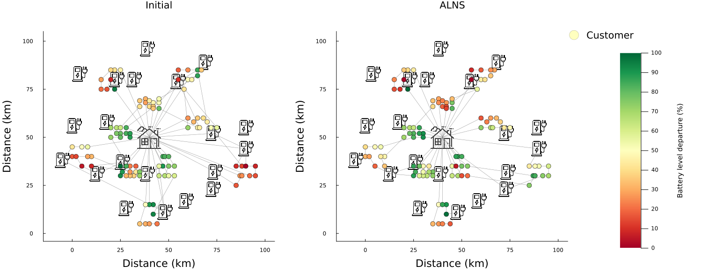
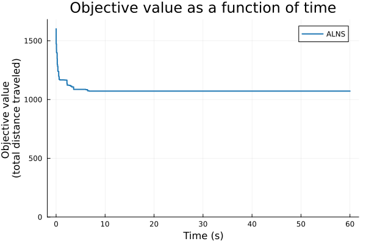
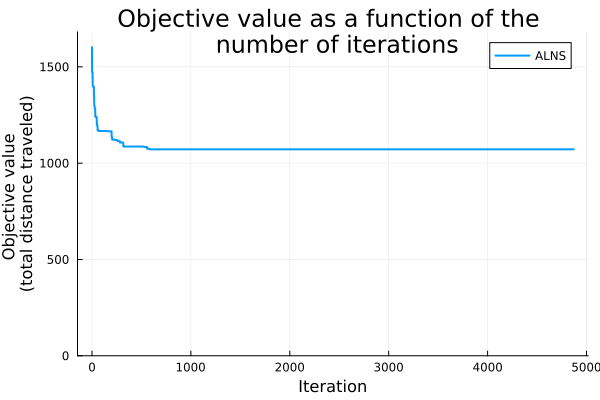
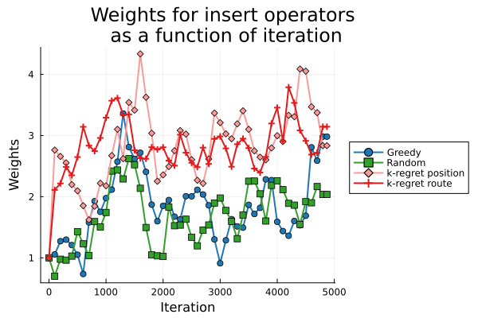
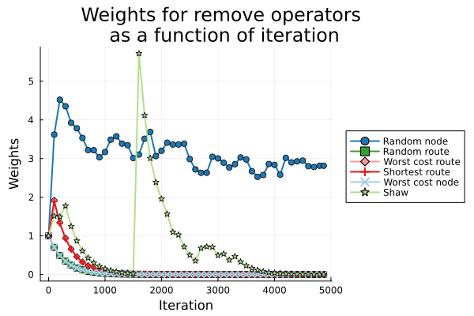

# Authors and purpose of this code
This code is authored by Ellinor Sorpola Svenningsson and Regina Gustavsson for the purpose of a master thesis in mathematical optimization.

# Table of contents
1. [How to run ALNS](#how-to-run-alns)
2. [Using Gurobi](#using-gurobi)
3. [Different EVRP variants that can be solved with the algorithm](#different-evrp-variants-that-can-be-solved-with-the-algorithm)
4. [Repository overview](#repository-overview)
5. [The solution struct EVRPSolution and its fields](#the-solution-struct-evrpsolution-and-its-fields)
6. [Implementation notes](#implementation-notes)
7. [Contributions](#contributions)
8. [Cite this code](#cite-this-code)

# How to run ALNS 
The Julia version used when developing the code, and the one that is known to work, is version 1.11.3. 

ALNS can be run by running the following lines in the Julia REPL:

    include("Main.jl")
    main("Data/SchneiderEVRPTW/c101_21.txt")

This generates the following figures

  
  

  
  

The run can be customized by giving keyword arguments to the `main` function. Some examples are 
- `seed = 113` changes the random seed, 
- `max_time = 120` increases the run time, and 
- `remove_proportion = 0.1` sets the proportion of nodes that are removed in each iteration to 0.1.

A full list of keyword arguments and expected types can be found in `Main.jl`. For a more detailed description of the algorithm and the design choices in this project, see `report.pdf`.

If the error `ERROR: Some parameters were not found in data file. Missing parameters: number of vehicles` is encountered when running a data file, the line `m number of vehicles /.../` where `...` is an integer must be added at the end of the data file. 

# Using Gurobi 

To run any file using the Gurobi package, a valid Gurobi license is required. Free academic licenses are available, but they typically require access to a school network to download. The license file should be placed according to the instructions found [Here](https://support.gurobi.com/hc/en-us/articles/360013417211-Where-do-I-place-the-Gurobi-license-file-gurobi-lic). The license is not required for the ALNS algorithm and Gurobi can be replaced with free solvers such as HiGHS or GLPK. However, if you choose to use an alternative solver, you will not get any benchmarking in the results, as they are not compatible with other solvers.

The line `ENV["GRB_NO_REVOKE"] = "1"` is needed with the WLS version of the 
license if it has been moved to a computer connected to a VPN with firewalls.

## How to run Gurobi 
The code to generate the solution from the commercial solver Gurobi is obtained by running the following lines in `Julia REPL`:

    include("Models/RunModel.jl")
    run_model("Data/SchneiderEVRPTW/c101_21.txt", 15)

This command generates a solution with 15 copies of each charging station, for the data instance `c101_21.txt`. The copies of the charging stations are necessary because, in the model, nodes can only be visited once. However, charging stations may need to be revisited or accessed by multiple vehicles. The copies are then treated as individual nodes that may only be visited once, meaning that the actual charging station may be visited $k$ times if there are $k$ copies. To customize the run, you can provide any combination of the keyword arguments listed below to the `run_model` function. 
- `solver` is set to `HiGHS` or `GLPK` if wanting to use another solver than Gurobi,  
- `problem_specifier` sets which problem variant to solve, 
- `time_limit` sets a time limit that terminates the run if not completed within the allotted time,
- `plotting` is a bool specifying if the routes in the last found solution should be plotted or not,
- `printing` is a bool specifying if information and messages generated during the run should be printed, and 
- `initial_solution_bool` is a bool specifying if the solver should be given an initial solution or not. 

# Different EVRP variants that can be solved with the algorithm 
In this project, three different variants of the Electric Vehicle Routing Problem (EVRP) were studied. The first one, called the basic variant, is the formulation that the remaining variants build on. All variants are similar and only have a single assumption varying compared to the basic variant. 

## Basic variant of the EVRP
The assumptions for this version are
- Constant speed and flat roads
- Only one depot
- All vehicles start and end in the depot
- The recharging and discharging of the battery are linear
- All customers should be visited exactly once
- Multiple charging station visits are allowed
- All nodes have time windows (opening hours)
- Vehicles only perform deliveries
- There are a number of available vehicles that can all be utilized without penalty
- Homogeneous fleet (all vehicles are identical)
- Limited weight capacity
- Full charging policy (all vehicles charge fully at charging stations)

This is the variant that is solved by ALNS when running `main` without a problem specifier. This is run with Gurobi following the instructions in the previous section [How to run Gurobi](#how-to-run-gurobi).

## EVRP with partial charging
This variant of the EVRP uses the partial charging policy, meaning that vehicles can leave the charging stations without charging fully. The remaining assumptions are as for the basic variant. To solve this variant with ALNS, the following lines are run in the REPL:

    include("Main.jl")
    main("Data/SchneiderEVRPTW/c101_21.txt", problem_specifier = ProblemSpecifierTypes.partial_charging)

It is solved using Gurobi with the following lines

    include("Models/RunModel.jl")
    run_model("Data/SchneiderEVRPTW/c101_21.txt",  problem_specifier =  ProblemSpecifierTypes.partial_charging, 15)

## EVRP with load-dependent discharging
This variant assumes that the energy consumption depends on the weight of the vehicle. The energy consumption rate is estimated as 

$$\Phi_1 + \Phi_2M$$

where $M$ is the total mass of the vehicle including the load. The exact formulas for calculating the constants $\Phi_1$ and $\Phi_2$ can be found in `report.pdf`. The energy consumption on an arc is calculated as its corresponding energy consumption rate multiplied by the time it takes to travel the arc. The remaining assumptions are as for the basic variant (with the full charging policy). This variant is run with ALNS using 

    include("Main.jl")
    main("Data/SchneiderEVRPTW/c101_21.txt", problem_specifier = ProblemSpecifierTypes.load_dependent)

and for Gurobi using 

    include("Models/RunModel.jl")
    run_model("Data/SchneiderEVRPTW/c101_21.txt", problem_specifier = ProblemSpecifierTypes.load_dependent, 15)

# Repository overview 

For future development of this code there are 5 folders containing the data and code. Each of them is explained below.

## Data 
The data used for this project is introduced in the article *Schneider M, Stenger A, Goeke D. The Electric Vehicle-Routing Problem with Time Windows and Recharging Stations. Transportation Science. 2014;48(4):500–20.* To be able to run the code on a data instance, it is important to add the line `m number of vehicles /.../` at the end of the data file where `...` is exchanged for a suitable integer describing the number of available vehicles. This has been done for some of the instances that were studied in the thesis. 

## Functions
Functions contains most of the functionality needed to run ALNS.

- `ALNS.jl`: Contains the code for the ALNS loop. ALNS can be run directly from the funtion in this file to get results, but it requires less user-friendly input arguments. Therefore `main.jl` is recommended for running the algorithm. 
- `ALNSFunctions.jl`: Contains functionality that can be exchanged to customize the ALNS algorithm. It contains the selection operator, the acceptance criteria and the termination criteria. To be interchangeable, without modifications in other files, they require the same input as the ones already implemented. 
- `DataParsing.jl`: Contains the code for parsing the data mentioned in the section [Data](#data).
- `EVRPFunctions.jl`: Contains functionality that can be exchanged to customize EVRP to fit different assumptions. It contains the objective function, energy consumption function, battery calculation functions etc. To be interchangeable, without modifications in other files, they require the same input as the ones already implemented. 
- `InitialSolution.jl`: Contains the initial solution algorithms. The one that works for all EVRP types is the one called `greedy_initial_solution`. The earliest time window heuristic (`create_initial_solution`) is more efficient but does not work for the EVRP with load dependent discharging.
- `InsertOperators.jl`: Contains the implementations of the insert operators studied in this project. To be interchangeable, without modifications in other files, they require the same input as the ones already implemented. 
- `RemoveOperators.jl`: Contains the implementations of the remove operators studied in this project. To be interchangeable, without modifications in other files, they require the same input as the ones already implemented. 
- `Utilities.jl`: Contains helper functions used in the ALNS. For example, a function for creating a solution on the required format from just the routes. The utilities are categorized in modules depending on where their functionality is mainly used. Examples are `RemoveUtilities` and `InsertUtilities`.

## Models
Contains the code required to solve the different model variants using a solver, such as Gurobi. The mathematical formulations of the models can be found in `report.pdf`.

## Plotting
The functions and pictures required to plot the routes, the objective as a function of time and the weights. 

## Testing
Contains code for testing the implemented functionality. Due to time limitations these are not testing everything and they are not as modular as one would wish. To run the tests the file `RunTests.jl` is run (no input arguments are required). 

## Results
The results folder contains all the results generated for the report. The results are divided into subfolders:
- `ResultsLarge`: contains results for datafiles with 100 customers, 10 minute runs.
- `ResultsMedium`: contains results for datafiles with 15 customers, 5 minute runs.
- `ResultsSmall`: contains results for datafiles with 5 customers, 1 minute runs.
- `ResultsLongRuns`: contains results for datafiles with 100 customers, 30 minute runs, only for the basic variant of the EVRP. 

In all subfolders but `ResultsLongRuns`, there are three files. They contain either "full", "partial" or "load_dependent" in the name, depending on which variant of the EVRP was solved. Here "full" refers to the basic variant that uses the full charging policy. 

The result files are loaded as 

    using JLD2
    result_file = "Results/result_extra_long_runs.jld2"
    data_file = "Data/SchneiderEVRPTW/rc203_21.txt"
    results_dict = load(result_file, "results")
    initial_solution, gurobi_results, alns_results = results_dict[data_file]

where the result and data files can be exchanged. The variable `results_dict` is a dictionary with the data file names as keys and the results as the values. Depending on the size of the dataset (large, medium or small) and the execution time (normal or extra long) the type of the stored results may vary. The initial solution is always of type `EVRPSolution`. For the small datasets, Gurobi was run 3 times to get an average of the time. Therefore, the corresponding `gurobi_results` is a vector with three elements. For the remaing sizes there is only one run and `gurobi_results` has type `GurobiResults`. For the long runs ALNS was only run once so that the corresponding `alns_results` is of type `Result`. Meanwhile, for the normal runs, where 3 different random seeds were used, `alns_results` is a vector of `Result`. 

Plotting the results can be done using the file `PlotResultsForReport.jl`. However, this file needs to be modified depending on which size and execution time was used. Also the correct reference value needs to be added (variable `reference_value`) from the article that introduced the data, see section [Data](#data). This is because of the difference in how the values were saved when running. Without modification, the file currently works for the result file with extra long runs and generates the following plots in order:

1. a plot of the routes in the initial solution,
2. a plot of the final routes after applying ALNS,
3. a plot of the final routes generated by Gurobi,
4. a plot of the insert operator weights,
5. a plot of the remove operator weights, and
6. a plot of the objective value as a function of time.

New results can be generated by running the file `GenerateResults.jl` with desired settings of which data files and problems to solve and for how long. Be careful not to overwrite existing results or by accident add onto them.

# The solution struct EVRPSolution and its fields 
A solution to the EVRP is stored as an object of the struct EVRPSolution defined in `Types.jl`. It consists of the fields
- `routes::Vector{Vector{NodeTypes.Node}}`: A list of routes. Each route is a list of nodes in the order they are visited. 
- `times_of_arrival::Vector{Vector{Float64}}`: Arrival times to each node in the routes. The outer vector corresponds to the routes and the inner one to the actual node visits. This means that the size is the same as that of `routes`. 
- `battery_arrival::Vector{Vector{Float64}}`: Battery level upon arrival. Has the same setup as `times_of_arrival`.
- `battery_departure::Vector{Vector{Float64}}`: Battery level upon departure. Has the same setup as `times_of_arrival`.
- `objective_value::Union{Nothing, Float64}`: The objective value of the solution. It starts as `nothing` and is modified by the objective function when it is called on the solution. 
- `is_feasible::Bool`: True if the solution is feasible with rights to the battery, time and weight constraints. 

## Example
Here is an example of what a solution could look like with all values made up. It uses 5 nodes where the node with index 1 is the depot and node 8 is a charging station. The variable `routes` is actually a vector of vector of `NodeTypes.Node` but since that is harder to show in an example, we instead put the node indices. 

    Q = full battery
    routes = [[1, 3, 5, 1], [1, 5, 7, 8, 1]]
    charging_arrival = [[Q, 0.8Q, 0.7Q, 0.5Q], [Q, 0.7Q, 0.5Q, 0.3Q, 0.6Q]]
    charging_departure = [[Q, 0.8Q, 0.7Q, 0.5Q], [Q, 0.7Q, 0.5Q, Q, 0.6Q]]
    recharging_times = [[0, 0, 0, 0], [0, 0, 0, 150, 0]]

 

# Implementation notes
- The distance between node $i$ and itself is set to `Inf`.
- The recharging rate in the code is actually the inverse recharging rate. So the time it takes to charge `k` units is `k * recharging_rate`.
- When using a termination criterion other than a time limit, such as a maximum number of iterations, a time limit must still be set. This ensures that the algorithm does not run indefinitely. 
- The charging station insert operator uses the distances when calculating the score and not the objective value as mentioned in the report. However, since the distance is what was minimized in this project, it is the same. **If one wishes to change the objective function** and still use the objective value change in the charging station k insert operator, this needs to be modified!

# Contributions
This project was carried out as a joint master's thesis by Ellinor Sorpola Svenningsson and Regina Gustavsson. While individual contributions are listed below, it is important to emphasize that the project is a collaborative effort. As such, most of the code cannot be attributed to a single individual, and the list should be seen as an overview of areas of responsibility. 

Ellinor:
- The file `DataParsing.jl`
- The module `BatteryCalculationFunctions` in `EVRPFunctions.jl`
- Insert operators: *greedy* and *random*
- Remove operators: *random route*, *worst cost node*, *worst cost route* and *shortest route*.
- The modules `SolutionUtilities`, `RemoveUtilities` and `InsertUtilities` in `Utilities.jl`

Regina:
- The file `InitialSolution.jl`
- Insert operators: *highest position* and *route regret*
- Remove operators: *random node* and *shaw* 
- The module `InitialSolutionUtilities` in `Utilities.jl`
- The file `ModelFunctions.jl`
- The file `ModelUtilities.jl`
- The route plotting functions in `PlotFunctions.jl`

